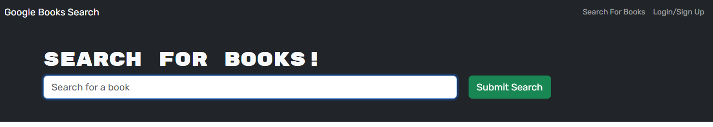
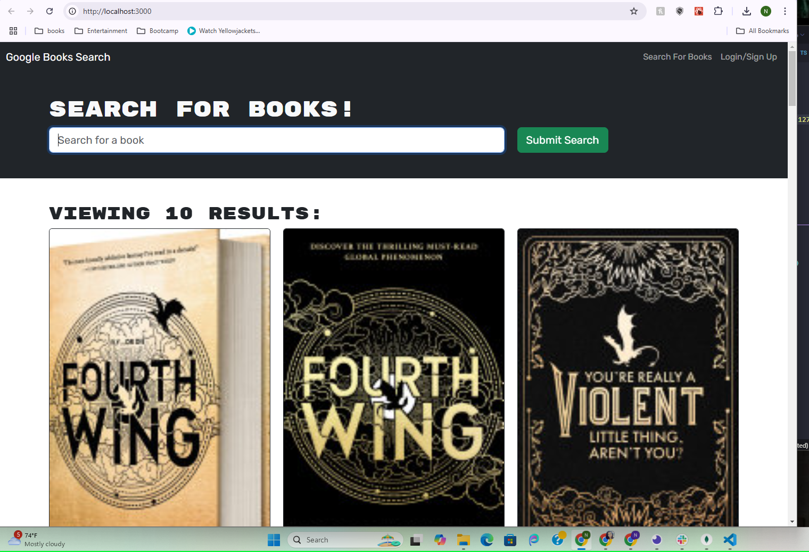
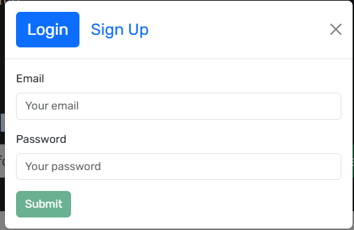

# Book-Bing

## Description
This application allows users to search for books using the Google Books API. Users can browse books without logging in, but to save books to their personal library, they need to create an account. The app provides a seamless experience for book enthusiasts to discover and manage their favorite reads.

## Table of Contents
- [Description](#description)
- [Installation](#installation)
- [Usage](#usage)
- [Collaborators](#collaborators)
- [Questions](#questions)

## Installation
To get the application up and running on your local machine, follow these steps:

1. **Clone the repository**  
   Use the following command to clone the repository to your local machine:
   ```bash
   git clone https://github.com/gh0st0wls/BookBing.git
   ```

2. **Install all necessary packages**  
   Navigate to the project directory and install the required dependencies by running:
   ```bash
   npm i
   ```

3. **Build and start the application**  
   Run the following commands to build and start the application in development mode:
   ```bash
   npm run build
   npm run start:dev
   ```
   You will then see the home screen which looks like the following:
   
   
Once the application is running, you can access it via your browser at `http://localhost:3000` (or the specified port).

## Usage
- **Searching for Books**:  
  You can search for books using the search bar on the homepage without needing to log in. Simply enter a book title or keyword and the app will display relevant results from the Google Books API. See below:


- **Creating an Account**:  
  To create an account, click on the "Sign Up" button, fill in the required details, and submit the form.


- **Logging In**:  
  If you already have an account, click on the "Login" button and enter your credentials to access your saved books.


## Questions
If you have any questions or need further assistance, feel free to reach out:
- **GitHub Profile**: https://github.com/gh0st0wls/BookBing 
- **Email**: dylanbender3@gmail.com
